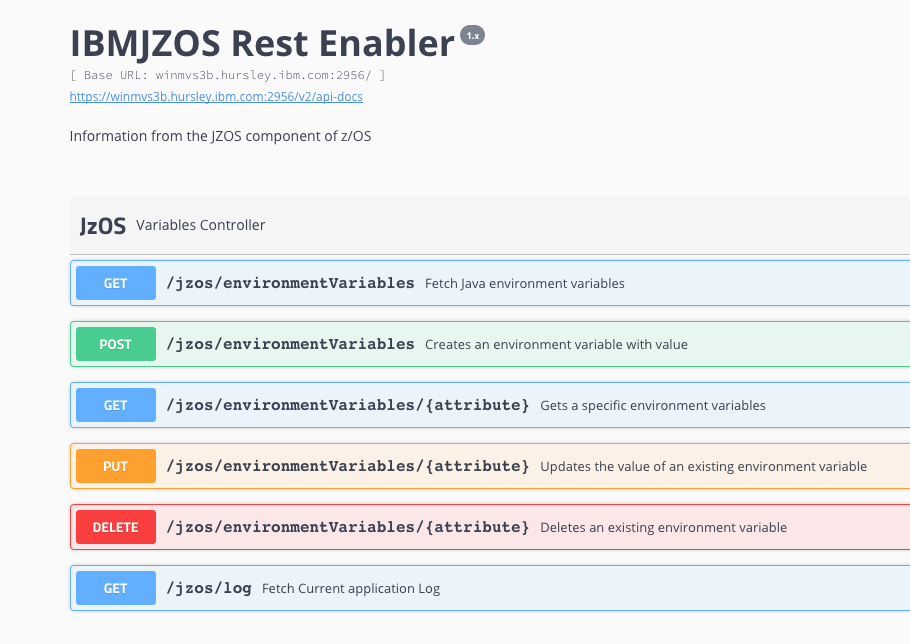

# spring-boot-jzos-sample

The intent of this sample is primarily to be a test application that can demonstrate onboarding to Zowe. By creating a Spring Boot App we can quickly demonstrate a z based Rest API application 

It is also a good sample for anyone wishing to create a Rest API Spring Boot application that creates swagger2.

This sample uses JZOS to provision a Rest API for accessing Java environmental variables. 
 

## Prerequisites 

* Build requires Maven installed on local machine

### Keystore
As this sample runs using HTTPS you need to reference a key store or create your own. Although creating your own is relatively straight forward I have reused the one used by the API mediation layer. It's worth noting that at the time of writing this Readme I have used a relative reference to the keystore and you should update based upon the location of the Zowe keystore used. 
  
  
### IBMJZOS.jar
The app has a dependency on IBMJZOS so for compiling you need to download from your z/OS installation. Simply copy the file from your Java installation. $JAVA_HOME/lib/ext/ibmjzos.jar call it ibmjzos-1.0.jar and save in the /libs folder of this project.  

## Procedure

* Download the sample to your local machine. 
* Download IBMJZOS from the host machine running Zowe. Create a lib folder off the project root and create the ibmjzos-1.0.jar file for compilation purposes
* Build the sample and transfer the file /jzos/target/jzos-0.0.1-SNAPSHOT.jar to a USS folder on the Zowe server.
* Transfer the jzos.sh file from the project root folder to the same USS folder on the Zowe server.
* Modify the shell script as necessary for the environment

### Shell Script

The shell script builds the required to specify the classpath and set environmental properties. Please check the valiidity on your system of:
* Location of JAVA_HOME
* key_store location and if an alternative keystore is used the type and passwords.
* An available port number
 
